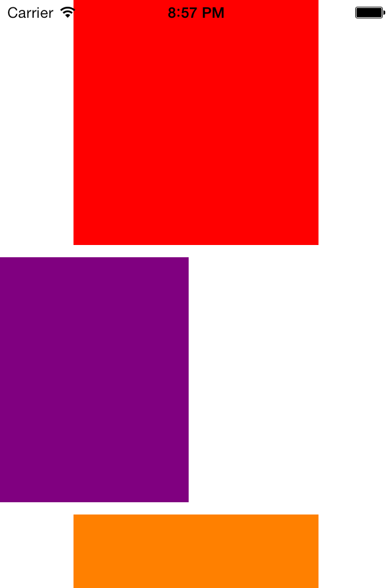

# LSSwipeToDeleteCollectionViewLayout

## Screenshots

<!-- Github -->

<!-- Local -->
<!--  -->

## Usage

To run the example project; clone the repo, and run `pod install` from the Project directory first.

## Requirements

## Installation

LSSwipeToDeleteCollectionViewLayout is available through [CocoaPods](http://cocoapods.org), to install
it simply add the following line to your Podfile:

    pod "LSSwipeToDeleteCollectionViewLayout"

## Author

Lukman Sanusi, larryryu@gmail.com

## License

LSSwipeToDeleteCollectionViewLayout is available under the MIT license. See the LICENSE file for more info.

